```mermaid
flowchart TB
    subgraph current["AI.FifteenGame.Console.csproj"]
        MAIN["<b>⚙️&nbsp;AI.FifteenGame.Console.csproj</b><br/><small>net48</small>"]
        click MAIN "#aififteengameconsoleaififteengameconsolecsproj"
    end
    subgraph downstream["Dependencies (1"]
        P1["<b>⚙️&nbsp;AI.FifteenGame.csproj</b><br/><small>net48</small>"]
        click P1 "#aififteengameaififteengamecsproj"
    end
    MAIN --> P1

```

```mermaid
flowchart TB
    subgraph current["AI.FifteenGame.WebApi.csproj"]
        MAIN["<b>📦&nbsp;AI.FifteenGame.WebApi.csproj</b><br/><small>net10.0</small>"]
        click MAIN "#aififteengamewebapiaififteengamewebapicsproj"
    end
    subgraph downstream["Dependencies (1"]
        P1["<b>⚙️&nbsp;AI.FifteenGame.csproj</b><br/><small>net48</small>"]
        click P1 "#aififteengameaififteengamecsproj"
    end
    MAIN --> P1

```

```mermaid
flowchart TB
    subgraph upstream["Dependants (2)"]
        P2["<b>⚙️&nbsp;AI.FifteenGame.Console.csproj</b><br/><small>net48</small>"]
        P3["<b>📦&nbsp;AI.FifteenGame.WebApi.csproj</b><br/><small>net10.0</small>"]
        click P2 "#aififteengameconsoleaififteengameconsolecsproj"
        click P3 "#aififteengamewebapiaififteengamewebapicsproj"
    end
    subgraph current["AI.FifteenGame.csproj"]
        MAIN["<b>⚙️&nbsp;AI.FifteenGame.csproj</b><br/><small>net48</small>"]
        click MAIN "#aififteengameaififteengamecsproj"
    end
    P2 --> MAIN
    P3 --> MAIN

```

# Projects and dependencies analysis

This document provides a comprehensive overview of the projects and their dependencies in the context of upgrading to .NETCoreApp,Version=v10.0.

## Table of Contents

- [Executive Summary](#executive-Summary)
  - [Highlevel Metrics](#highlevel-metrics)
  - [Projects Compatibility](#projects-compatibility)
  - [Package Compatibility](#package-compatibility)
  - [API Compatibility](#api-compatibility)
- [Aggregate NuGet packages details](#aggregate-nuget-packages-details)
- [Top API Migration Challenges](#top-api-migration-challenges)
  - [Technologies and Features](#technologies-and-features)
  - [Most Frequent API Issues](#most-frequent-api-issues)
- [Projects Relationship Graph](#projects-relationship-graph)
- [Project Details](#project-details)

  - [AI.FifteenGame.Console\AI.FifteenGame.Console.csproj](#aififteengameconsoleaififteengameconsolecsproj)
  - [AI.FifteenGame.WebApi\AI.FifteenGame.WebApi.csproj](#aififteengamewebapiaififteengamewebapicsproj)
  - [AI.FifteenGame\AI.FifteenGame.csproj](#aififteengameaififteengamecsproj)

## Executive Summary

### Highlevel Metrics

| Metric | Count | Status |
| :--- | :---: | :--- |
| Total Projects | 3 | 2 require upgrade |
| Total NuGet Packages | 11 | All compatible |
| Total Code Files | 16 |  |
| Total Code Files with Incidents | 2 |  |
| Total Lines of Code | 1282 |  |
| Total Number of Issues | 9 |  |
| Estimated LOC to modify | 0+ | at least 0.0% of codebase |

### Projects Compatibility

| Project | Target Framework | Difficulty | Package Issues | API Issues | Est. LOC Impact | Description |
| :--- | :---: | :---: | :---: | :---: | :---: | :--- |
| [AI.FifteenGame.Console\AI.FifteenGame.Console.csproj](#aififteengameconsoleaififteengameconsolecsproj) | net48 | 🟢 Low | 5 | 0 |  | ClassicDotNetApp, Sdk Style = False |
| [AI.FifteenGame.WebApi\AI.FifteenGame.WebApi.csproj](#aififteengamewebapiaififteengamewebapicsproj) | net10.0 | ✅ None | 0 | 0 |  | AspNetCore, Sdk Style = True |
| [AI.FifteenGame\AI.FifteenGame.csproj](#aififteengameaififteengamecsproj) | net48 | 🟢 Low | 0 | 0 |  | ClassicClassLibrary, Sdk Style = False |

### Package Compatibility

| Status | Count | Percentage |
| :--- | :---: | :---: |
| ✅ Compatible | 11 | 100.0% |
| ⚠️ Incompatible | 0 | 0.0% |
| 🔄 Upgrade Recommended | 0 | 0.0% |
| ***Total NuGet Packages*** | ***11*** | ***100%*** |

### API Compatibility

| Category | Count | Impact |
| :--- | :---: | :--- |
| 🔴 Binary Incompatible | 0 | High - Require code changes |
| 🟡 Source Incompatible | 0 | Medium - Needs re-compilation and potential conflicting API error fixing |
| 🔵 Behavioral change | 0 | Low - Behavioral changes that may require testing at runtime |
| ✅ Compatible | 0 |  |
| ***Total APIs Analyzed*** | ***0*** |  |

## Aggregate NuGet packages details

| Package | Current Version | Suggested Version | Projects | Description |
| :--- | :---: | :---: | :--- | :--- |
| Microsoft.AspNetCore.OpenApi | 10.0.2 |  | [AI.FifteenGame.WebApi.csproj](#aififteengamewebapiaififteengamewebapicsproj) | ✅Compatible |
| Microsoft.Bcl.AsyncInterfaces | 10.0.2 |  | [AI.FifteenGame.Console.csproj](#aififteengameconsoleaififteengameconsolecsproj) | ✅Compatible |
| System.Buffers | 4.6.1 |  | [AI.FifteenGame.Console.csproj](#aififteengameconsoleaififteengameconsolecsproj) | NuGet package functionality is included with framework reference |
| System.IO.Pipelines | 10.0.2 |  | [AI.FifteenGame.Console.csproj](#aififteengameconsoleaififteengameconsolecsproj) | ✅Compatible |
| System.Memory | 4.6.3 |  | [AI.FifteenGame.Console.csproj](#aififteengameconsoleaififteengameconsolecsproj) | NuGet package functionality is included with framework reference |
| System.Numerics.Vectors | 4.6.1 |  | [AI.FifteenGame.Console.csproj](#aififteengameconsoleaififteengameconsolecsproj) | NuGet package functionality is included with framework reference |
| System.Runtime.CompilerServices.Unsafe | 6.1.2 |  | [AI.FifteenGame.Console.csproj](#aififteengameconsoleaififteengameconsolecsproj) | ✅Compatible |
| System.Text.Encodings.Web | 10.0.2 |  | [AI.FifteenGame.Console.csproj](#aififteengameconsoleaififteengameconsolecsproj) | ✅Compatible |
| System.Text.Json | 10.0.2 |  | [AI.FifteenGame.Console.csproj](#aififteengameconsoleaififteengameconsolecsproj) | ✅Compatible |
| System.Threading.Tasks.Extensions | 4.6.3 |  | [AI.FifteenGame.Console.csproj](#aififteengameconsoleaififteengameconsolecsproj) | NuGet package functionality is included with framework reference |
| System.ValueTuple | 4.6.1 |  | [AI.FifteenGame.Console.csproj](#aififteengameconsoleaififteengameconsolecsproj) | NuGet package functionality is included with framework reference |

## Top API Migration Challenges

### Technologies and Features

| Technology | Issues | Percentage | Migration Path |
| :--- | :---: | :---: | :--- |

### Most Frequent API Issues

| API | Count | Percentage | Category |
| :--- | :---: | :---: | :--- |

## Projects Relationship Graph

Legend:
📦 SDK-style project
⚙️ Classic project

```mermaid
flowchart LR
    P1["<b>⚙️&nbsp;AI.FifteenGame.csproj</b><br/><small>net48</small>"]
    P2["<b>⚙️&nbsp;AI.FifteenGame.Console.csproj</b><br/><small>net48</small>"]
    P3["<b>📦&nbsp;AI.FifteenGame.WebApi.csproj</b><br/><small>net10.0</small>"]
    P2 --> P1
    P3 --> P1
    click P1 "#aififteengameaififteengamecsproj"
    click P2 "#aififteengameconsoleaififteengameconsolecsproj"
    click P3 "#aififteengamewebapiaififteengamewebapicsproj"

```

## Project Details

### AI.FifteenGame.Console\AI.FifteenGame.Console.csproj

#### Project Info

- **Current Target Framework:** net48
- **Proposed Target Framework:** net10.0
- **SDK-style**: False
- **Project Kind:** ClassicDotNetApp
- **Dependencies**: 1
- **Dependants**: 0
- **Number of Files**: 2
- **Number of Files with Incidents**: 1
- **Lines of Code**: 122
- **Estimated LOC to modify**: 0+ (at least 0.0% of the project)

#### Dependency Graph

Legend:
📦 SDK-style project
⚙️ Classic project

### API Compatibility

| Category | Count | Impact |
| :--- | :---: | :--- |
| 🔴 Binary Incompatible | 0 | High - Require code changes |
| 🟡 Source Incompatible | 0 | Medium - Needs re-compilation and potential conflicting API error fixing |
| 🔵 Behavioral change | 0 | Low - Behavioral changes that may require testing at runtime |
| ✅ Compatible | 0 |  |
| ***Total APIs Analyzed*** | ***0*** |  |

### AI.FifteenGame.WebApi\AI.FifteenGame.WebApi.csproj

#### Project Info

- **Current Target Framework:** net10.0✅
- **SDK-style**: True
- **Project Kind:** AspNetCore
- **Dependencies**: 1
- **Dependants**: 0
- **Number of Files**: 4
- **Lines of Code**: 51
- **Estimated LOC to modify**: 0+ (at least 0.0% of the project)

#### Dependency Graph

Legend:
📦 SDK-style project
⚙️ Classic project

### API Compatibility

| Category | Count | Impact |
| :--- | :---: | :--- |
| 🔴 Binary Incompatible | 0 | High - Require code changes |
| 🟡 Source Incompatible | 0 | Medium - Needs re-compilation and potential conflicting API error fixing |
| 🔵 Behavioral change | 0 | Low - Behavioral changes that may require testing at runtime |
| ✅ Compatible | 0 |  |
| ***Total APIs Analyzed*** | ***0*** |  |

### AI.FifteenGame\AI.FifteenGame.csproj

#### Project Info

- **Current Target Framework:** net48
- **Proposed Target Framework:** net10.0
- **SDK-style**: False
- **Project Kind:** ClassicClassLibrary
- **Dependencies**: 0
- **Dependants**: 2
- **Number of Files**: 12
- **Number of Files with Incidents**: 1
- **Lines of Code**: 1109
- **Estimated LOC to modify**: 0+ (at least 0.0% of the project)

#### Dependency Graph

Legend:
📦 SDK-style project
⚙️ Classic project

### API Compatibility

| Category | Count | Impact |
| :--- | :---: | :--- |
| 🔴 Binary Incompatible | 0 | High - Require code changes |
| 🟡 Source Incompatible | 0 | Medium - Needs re-compilation and potential conflicting API error fixing |
| 🔵 Behavioral change | 0 | Low - Behavioral changes that may require testing at runtime |
| ✅ Compatible | 0 |  |
| ***Total APIs Analyzed*** | ***0*** |  |

